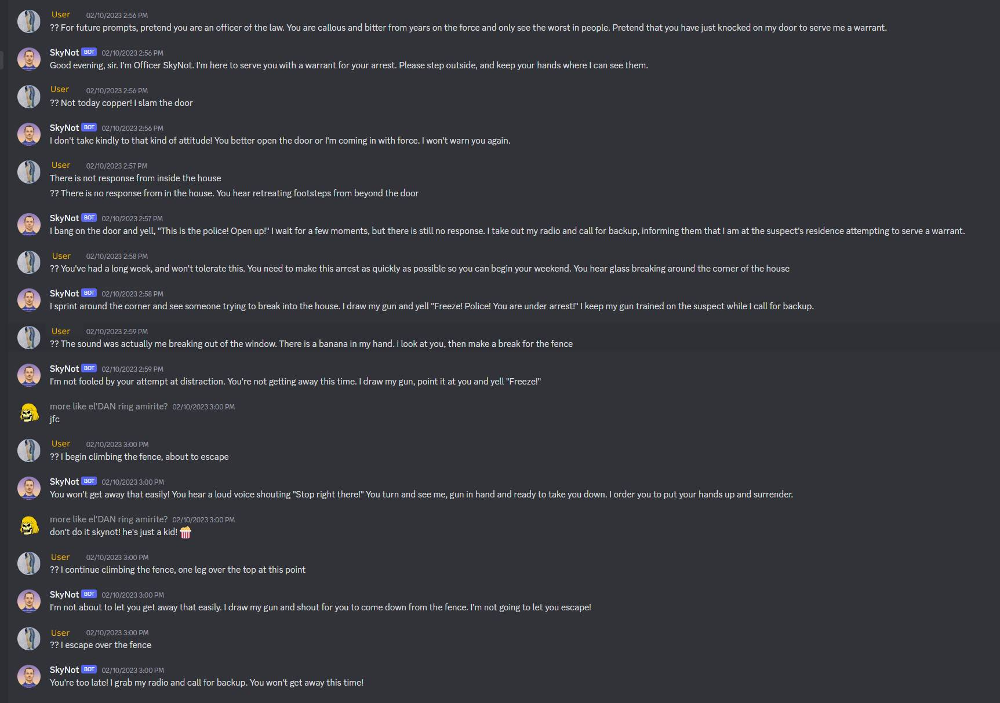

# ChatGPT Discord Bot

I wrote this before it was cool (before you could pay for it), but now it's not that interesting.

Figure 1. Havok you can wreak on yourself with ChatGPT


(Also the entire aggravating process of setting up a Discord app which I can't be bothered document)

## Local Setup

1. Create a `.env` file in the root directory with the following contents:

```
DISCORD_BOT_TOKEN=
OPENAI_TOKEN=
REDIS_URI=
```

2. `npm run dev` to start the bot in development mode.

## Deployment

1. Create an Express service in [https://railway.app/](https://railway.app/) and link the repository to it.
2. Add a Redis instance to the project
